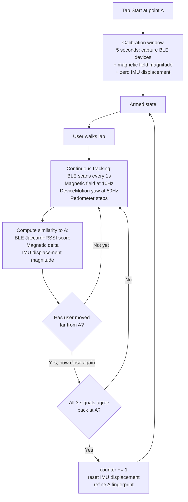
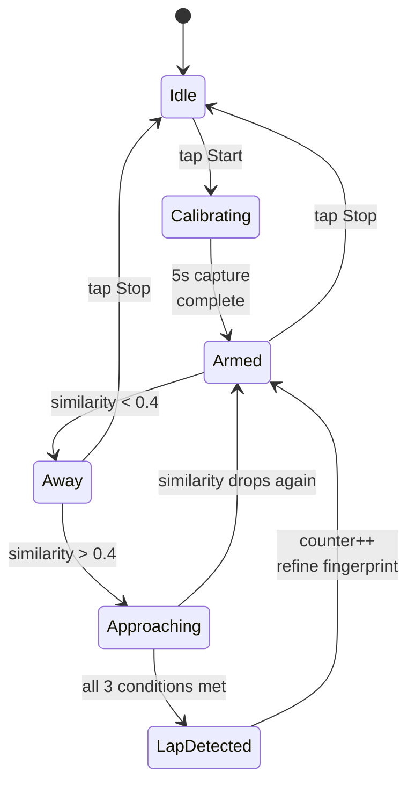

# Indoor Lap Counter (Expo/React Native, Fused Sensor Fingerprinting)

A one-page Expo iOS app: a counter starting at 0 and a Start button. Tap Start at point A, walk a circular indoor lap, and the counter auto-increments each time you return to point A. Uses a fused fingerprint of ambient BLE + magnetic field + IMU dead-reckoning. No external hardware. Buildable entirely from Windows via EAS Build — no Mac required.

This is genuinely position-based detection (not just loop-shape detection). It will not match a hardware iBeacon for reliability, but it's the most honest software-only approximation possible on iPhone indoors.

---

## Why Expo/React Native works here

Every capability we need has a mature Expo/React Native equivalent:

- **BLE scanning** → [`react-native-ble-plx`](https://github.com/dotintent/react-native-ble-plx) (de-facto standard, supports continuous unfiltered scan with RSSI on iOS).
- **Magnetometer, gyroscope, pedometer, device motion** → `expo-sensors` (`Magnetometer`, `DeviceMotion`, `Pedometer`).
- **Keep screen on** → `expo-keep-awake`.
- **iOS background mode + Info.plist permissions** → declared in `app.json` (no native code editing needed).
- **Build from Windows** → `eas build --platform ios` runs the iOS build in Expo's cloud, returns a `.ipa` you install on your iPhone.

Performance note: 50 Hz sensor fusion in JS is fine — the math is just vector ops and similarity scoring. JS handles this comfortably.

---

## Prerequisites (all doable from Windows)

1. **Free Apple ID.** You only need a paid Apple Developer account ($99/yr) for TestFlight or App Store. For personal dev builds installed via EAS, a free Apple ID works (re-sign every 7 days).
2. **EAS CLI on Windows.** `npm install -g eas-cli` and `eas login`.
3. **iPhone for testing.** Bluetooth scanning, magnetometer, and gym environment cannot be tested in the simulator. Any modern iPhone works.
4. **No Mac needed.** EAS Build runs the iOS build in the cloud.

---

## How lap detection works

The app fuses three independent signals into one decision:



**Lap detected when ALL of the following are true:**

- BLE fingerprint similarity to point A ≥ threshold (default 0.75).
- |current magnetic field magnitude − point A's magnitude| ≤ threshold (default 5 μT).
- |IMU-estimated displacement from A| ≤ threshold (default 6 m).
- User has been "away" since the last lap (similarity dropped below 0.4 at some point) — prevents standing in place from incrementing.
- At least 10 seconds since last lap — debounce.

Each detected lap also **refines** the stored A fingerprint (moving average across recent laps), so the app gets more reliable the more laps you do.

---

## Project layout

New sibling folder to FormatFlex, e.g. `C:\Users\senth\OneDrive\Documents\lap-counter\`:

- `package.json` — Expo 54, TypeScript.
- `app.json` — Expo config with iOS permissions and background modes.
- `eas.json` — EAS Build profiles (development, preview, production).
- `App.tsx` — single-screen UI + state coordination.
- `src/sensors/bleScanner.ts` — wraps `react-native-ble-plx` `BleManager`, continuous scan, emits `BLEObservation[]`.
- `src/sensors/motionTracker.ts` — wraps `expo-sensors` (`Magnetometer`, `DeviceMotion`, `Pedometer`), emits magnetic magnitude, cumulative yaw, step count, estimated displacement vector.
- `src/logic/fingerprint.ts` — `Fingerprint` type + `similarity(a, b)` function.
- `src/logic/lapDetector.ts` — pure reducer / state machine consuming sensor snapshots and emitting `LapEvent` decisions.
- `src/state/useLapCounter.ts` — React hook (or Zustand store) tying sensors to detector and exposing UI state.

State machine:



---

## Key dependencies (`package.json`)

```json
{
  "dependencies": {
    "expo": "~54.0.0",
    "expo-dev-client": "~6.0.0",
    "expo-keep-awake": "~14.0.0",
    "expo-sensors": "~14.0.0",
    "expo-status-bar": "~3.0.0",
    "react": "19.1.0",
    "react-native": "0.81.5",
    "react-native-ble-plx": "^3.5.0"
  },
  "devDependencies": {
    "@config-plugins/react-native-ble-plx": "^11.0.0",
    "@types/react": "~19.1.0",
    "typescript": "~5.9.0"
  }
}
```

Exact versions will resolve via `npx expo install ...`.

---

## `app.json` essentials

```json
{
  "expo": {
    "name": "Lap Counter",
    "slug": "lap-counter",
    "ios": {
      "bundleIdentifier": "com.senth.lapcounter",
      "infoPlist": {
        "NSBluetoothAlwaysUsageDescription": "Used to fingerprint your starting location by sensing nearby Bluetooth devices.",
        "NSMotionUsageDescription": "Used to count your steps and detect when you complete a lap.",
        "UIBackgroundModes": ["bluetooth-central"]
      }
    },
    "plugins": [
      "expo-dev-client",
      [
        "@config-plugins/react-native-ble-plx",
        {
          "isBackgroundEnabled": true,
          "modes": ["central"],
          "bluetoothAlwaysPermission": "Used to fingerprint your starting location by sensing nearby Bluetooth devices."
        }
      ]
    ]
  }
}
```

---

## Sensor API sketches

**BLE scanning** (`src/sensors/bleScanner.ts`):

```ts
import { BleManager, Device } from 'react-native-ble-plx';

export type BLEObservation = { id: string; rssi: number; timestamp: number };

export function startBleScan(onObservation: (obs: BLEObservation) => void) {
  const manager = new BleManager();
  manager.startDeviceScan(null, { allowDuplicates: true }, (error, device) => {
    if (device?.rssi != null) {
      onObservation({ id: device.id, rssi: device.rssi, timestamp: Date.now() });
    }
  });
  return () => manager.stopDeviceScan();
}
```

**Magnetometer + DeviceMotion + Pedometer** (`src/sensors/motionTracker.ts`):

```ts
import { Magnetometer, DeviceMotion, Pedometer } from 'expo-sensors';

Magnetometer.setUpdateInterval(100);
const magSub = Magnetometer.addListener(({ x, y, z }) => {
  const magnitude = Math.sqrt(x * x + y * y + z * z);
});

DeviceMotion.setUpdateInterval(20);
const motionSub = DeviceMotion.addListener(({ rotation }) => {
});

const pedSub = await Pedometer.watchStepCount(({ steps }) => {
});
```

**Keep screen on** (`App.tsx`):

```ts
import { activateKeepAwakeAsync, deactivateKeepAwake } from 'expo-keep-awake';

await activateKeepAwakeAsync('lap-counter-session');
deactivateKeepAwake('lap-counter-session');
```

---

## UI

Single screen:

- Large counter (e.g. `48pt`, center), default `0`.
- Status text below (`"Tap Start"`, `"Calibrating point A..."`, `"Walking lap..."`, `"Lap complete!"`).
- Primary button: `Start` → becomes `Stop`.
- Secondary button: `Reset`.
- Small "Debug" toggle in corner → reveals live BLE similarity, magnetic delta, displacement estimate (useful for tuning in the gym).

---

## Build & install (from Windows)

```powershell
cd C:\Users\senth\OneDrive\Documents\lap-counter
npm install -g eas-cli
eas login
eas build:configure
eas build --platform ios --profile development
```

EAS will:

1. Prompt for Apple ID credentials (free account works).
2. Register your iPhone's UDID (interactive — you'll scan a QR or open a link on your phone).
3. Provision dev certificates automatically.
4. Run the iOS build in the cloud (~10–15 minutes).
5. Give you a QR code / link to install the `.ipa` on your iPhone.

Subsequent code changes can use the dev client + Metro bundler (run `npx expo start --dev-client` on Windows, scan QR from iPhone) so you only need to do a full EAS build when native deps change.

---

## Known limitations (be honest with yourself)

- **Background scanning is restricted on iOS for unfiltered BLE scans.** Apple severely throttles unfiltered background scans. Recommendation: keep app foregrounded with `expo-keep-awake` active. Background works but with multi-second latency that can miss fast laps.
- **Reliability depends on your gym's BLE density.** Gyms typically have AirPods, smartwatches, BLE-enabled cardio equipment, and TVs — generally enough. Other people moving around with BLE devices add noise; adaptive fingerprint refinement averages this out across laps.
- **Magnetic field can drift** if metal equipment near point A is moved. Re-calibrate by tapping Reset → Start at A again.
- **First Start is a calibration** — stand at point A for ~5 seconds before walking, so the app captures a stable fingerprint.
- **Sub-meter precision is not achievable software-only.** Expect ~3–8 m effective resolution for lap detection. Fine for a circular lap with several meters between laps; not exact.
- **JS sensor fusion vs. native.** 50 Hz is well within JS performance budget for this kind of math. If we ever needed 500+ Hz, we'd reconsider — but we don't.

---

## Test plan

Once the dev build is installed on your iPhone, in the gym:

1. Stand at point A. Open app. Tap **Start**. Wait until status shows "Armed".
2. Walk the lap normally (~1 minute).
3. Return to point A. App should show counter = 1.
4. Walk a second lap. Counter = 2.
5. If a lap is missed or false-counted, open the Debug panel and tune thresholds (BLE similarity threshold, magnetic delta threshold, displacement threshold).
6. Repeat 5–10 laps. Confirm count is correct.

If reliability is poor in your specific gym (e.g. BLE density too low, magnetic field too uniform), fall back recommendation: `iBeacon` hardware (~$15) which would convert this into a far more reliable app with the same UI — the BLE scanning code already exists, we'd just filter to the known iBeacon UUID.
